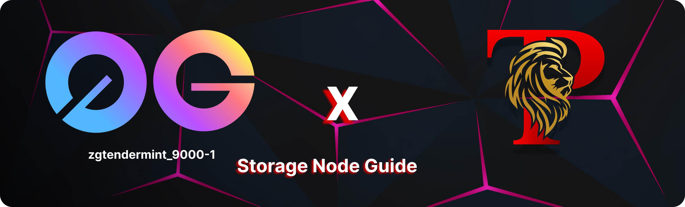

## Overview
0G Storage serves as the foundational storage layer for the ZeroGravity data availability (DA) system. This layer is integral to the system's architecture, offering robust data storage and retrieval mechanisms inherently built into ZeroGravity.

## Key Features

### Built-in Integration
0G Storage is seamlessly integrated within the ZeroGravity DA system, ensuring optimized performance and direct access for data handling within the ecosystem.

### General Purpose Functionality
Designed to accommodate a wide array of applications, 0G Storage supports atomic transactions, mutable key-value stores, and archive log systems. This versatility makes it suitable for handling diverse data types across various applications.

### Incentivized Participation
Moving beyond a traditional decentralized database, 0G Storage incorporates the Proof of Replicated Availability (PoRA) mining algorithm. This innovation incentivizes participants in the storage network, rewarding them for their contributions to data availability and integrity.
<div align="center">
  <a href="https://0g.ai/"></a>
  <a href="https://github.com/0glabs"></a>
  <a href="https://twitter.com/0G_labs"></a>
  <a href="https://discord.gg/0glabs"></a>
  <a href="https://blog.0g.ai/"></a>
</div>

## Navigation

- [Overview](#overview)
- [Key Features](#key-features)
  - [Built-in Integration](#built-in-integration)
  - [General Purpose Functionality](#general-purpose-functionality)
  - [Incentivized Participation](#incentivized-participation)
- [Navigation](#navigation)
- [Storage Node](#storage-node)
- [Hardware requirements](#hardware-requirements)
- [Installation guide](#installation-guide)
  - [1. Install required packages](#1-install-required-packages)
  - [2. Install rustup](#2-install-rustup)
  - [3. Install Go](#3-install-go)
  - [4. Build `zgs_node` binary](#4-build-zgs_node-binary)
  - [5. Set up variables](#5-set-up-variables)
  - [6. Get wallet private key](#6-get-wallet-private-key)
  - [7. Update node configuration](#7-update-node-configuration)
  - [8. Create a service file](#8-create-a-service-file)
  - [9. Start the node](#9-start-the-node)
- [Useful commands](#useful-commands)
  - [Restart the node](#restart-the-node)
  - [Stop the node](#stop-the-node)
  - [Delete the node from the server](#delete-the-node-from-the-server)
  - [Upgrade the node](#upgrade-the-node)
  - [View the latest log file](#view-the-latest-log-file)
  - [Search for errors](#search-for-errors)
  - [List logs by date](#list-logs-by-date)
  - [View specific date logs](#view-specific-date-logs)

## Storage Node

## Hardware requirements
```py
- Memory: 16 GB RAM
- CPU: 4 cores
- Disk: 500GB / 1TB NVME SSD
- Bandwidth: 500mbps Gbps for Download / Upload
- Linux amd64 arm64 (The guide was tested on Ubuntu 20.04 LTS)
```

## Installation guide

### 1. Install required packages
```bash
sudo apt update && \
sudo apt install curl git jq build-essential gcc unzip wget lz4 openssl -y
```
### 2. Install rustup
```bash
curl --proto '=https' --tlsv1.2 -sSf https://sh.rustup.rs | sh
```
### 3. Install Go
```bash
cd $HOME && \
ver="1.21.3" && \
wget "https://golang.org/dl/go$ver.linux-amd64.tar.gz" && \
sudo rm -rf /usr/local/go && \
sudo tar -C /usr/local -xzf "go$ver.linux-amd64.tar.gz" && \
rm "go$ver.linux-amd64.tar.gz" && \
echo "export PATH=$PATH:/usr/local/go/bin:$HOME/go/bin" >> ~/.bash_profile && \
source ~/.bash_profile && \
go version
```
### 4. Build `zgs_node` binary
```bash
cd $HOME
git clone https://github.com/0glabs/0g-storage-node.git
cd 0g-storage-node
git checkout tags/v1.0.0-testnet
git submodule update --init
cargo build --release
sudo mv $HOME/0g-storage-node/target/release/zgs_node /usr/local/bin
```
### 5. Set up variables
```bash
echo 'export ZGS_CONFIG_FILE="$HOME/0g-storage-node/run/config.toml"' >> ~/.bash_profile
echo 'export ZGS_LOG_DIR="$HOME/0g-storage-node/run/log"' >> ~/.bash_profile
echo 'export ZGS_LOG_CONFIG_FILE="$HOME/0g-storage-node/run/log_config"' >> ~/.bash_profile

source ~/.bash_profile
```
### 6. Get wallet private key
To obtain a wallet private key, you have two options:

`From MetaMask:` If you already have a wallet configured in MetaMask, you can use the private key associated with the MetaMask account.

`Generate a New Wallet Using CLI:` If you prefer to create a new wallet, you can use the `evmosd` command-line interface. Follow the steps provided in this guide to generate a new wallet: [Create Wallet](https://github.com/trusted-point/0g-tools?tab=readme-ov-file#14-create-a-wallet-for-your-validator).

After creating the wallet, you can use the following command to export the private key:
```bash
evmosd keys unsafe-export-eth-key $WALLET_NAME
```
Store your private key in variable:
```bash
read -sp "Enter your private key: " PRIVATE_KEY && echo
```
### 7. Update node configuration
```bash
if grep -q '# miner_id' $ZGS_CONFIG_FILE; then
    MINER_ID=$(openssl rand -hex 32)
    sed -i "/# miner_id/c\miner_id = \"$MINER_ID\"" $ZGS_CONFIG_FILE
fi

if grep -q '# miner_key' $ZGS_CONFIG_FILE; then
    sed -i "/# miner_key/c\miner_key = \"$PRIVATE_KEY\"" $ZGS_CONFIG_FILE
fi

sed -i "s|^log_config_file =.*$|log_config_file = \"$ZGS_LOG_CONFIG_FILE\"|" $ZGS_CONFIG_FILE

if ! grep -q "^log_directory =" "$ZGS_CONFIG_FILE"; then
    echo "log_directory = \"$ZGS_LOG_DIR\"" >> "$ZGS_CONFIG_FILE"
fi
```
### 8. Create a service file
```bash
sudo tee /etc/systemd/system/zgs.service > /dev/null <<EOF
[Unit]
Description=0G Storage Node
After=network.target

[Service]
User=$USER
Type=simple
ExecStart=zgs_node --config $ZGS_CONFIG_FILE
Restart=on-failure
LimitNOFILE=65535

[Install]
WantedBy=multi-user.target
EOF
```
### 9. Start the node
```bash
sudo systemctl daemon-reload && \
sudo systemctl enable zgs && \
sudo systemctl restart zgs && \
sudo systemctl status zgs
```
## Useful commands
### Restart the node
```bash
sudo systemctl restart zgs
```
### Stop the node
```bash
sudo systemctl stop zgs
```
### Delete the node from the server
Before deleting the node, you might want to save your `miner_id` and `miner_key` from the configuration file. Use the following commands to print these values:
```bash
grep 'miner_id' $ZGS_CONFIG_FILE
grep 'miner_key' $ZGS_CONFIG_FILE
```
```bash
sudo systemctl stop zgs
sudo systemctl disable zgs
sudo rm /etc/systemd/system/zgs.service
rm -rf $HOME/0g-storage-node
```
### Upgrade the node
```bash
cd $HOME/0g-storage-node
git fetch
git checkout tags/<version>
git submodule update --init
cargo build --release
sudo mv $HOME/0g-storage-node/target/release/zgs_node /usr/local/bin
```
### View the latest log file
```bash
tail -n 100 "$ZGS_LOG_DIR/$(ls -Art $ZGS_LOG_DIR | tail -n 1)"
```
### Search for errors
```bash
grep "Error" $ZGS_LOG_DIR/zgs.log.*
```
### List logs by date
```bash
ls -lt $ZGS_LOG_DIR
```
### View specific date logs
```bash
cat $ZGS_LOG_DIR/zgs.log.2024-04-15
```
